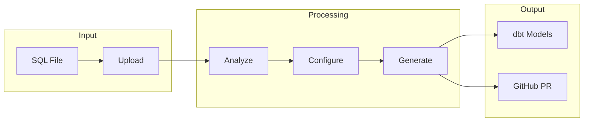
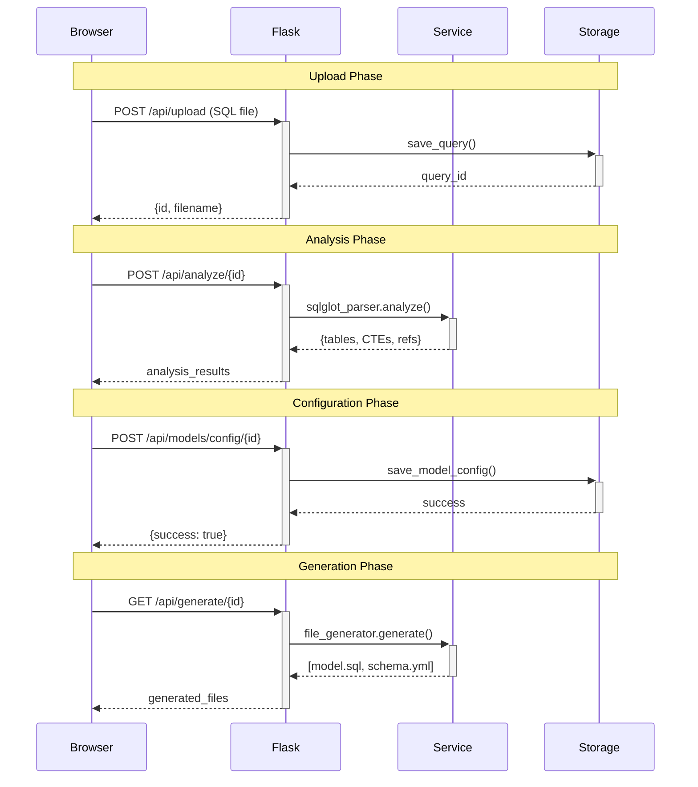
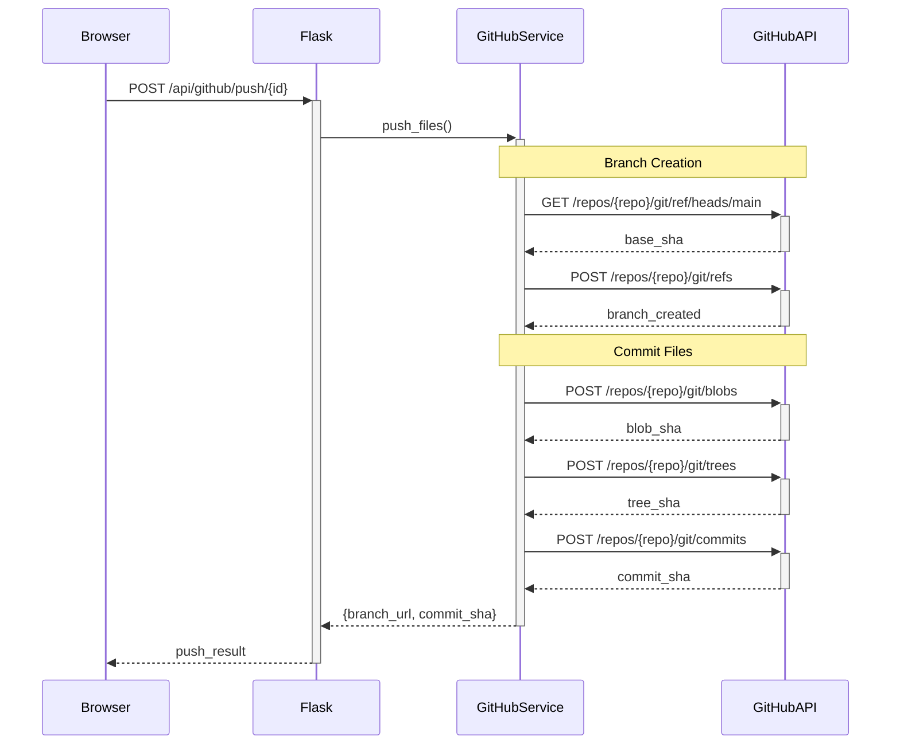
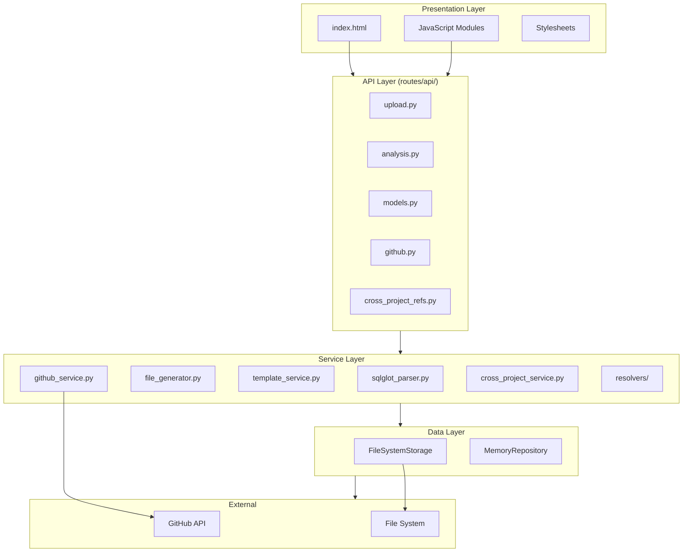
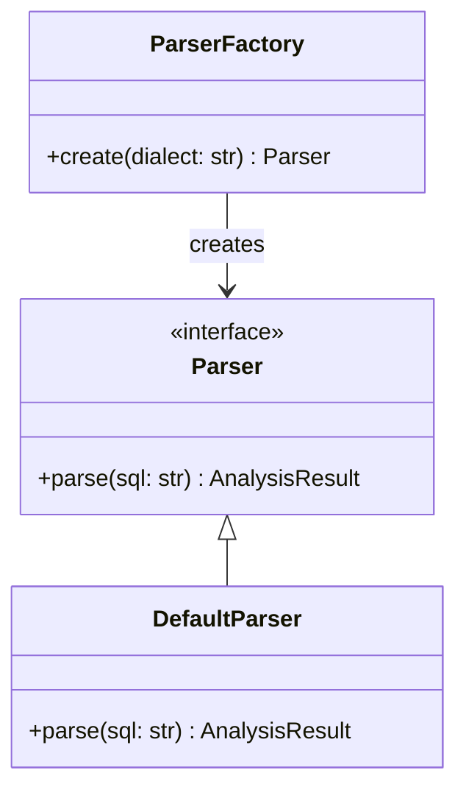
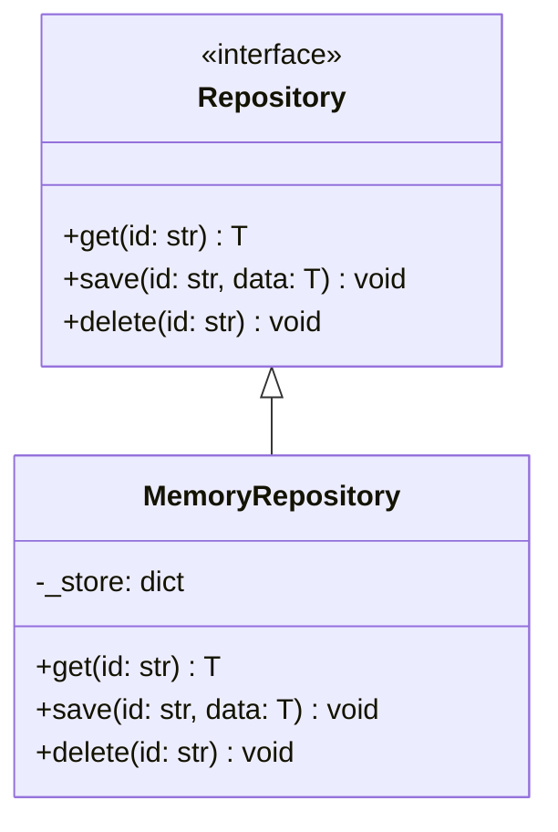
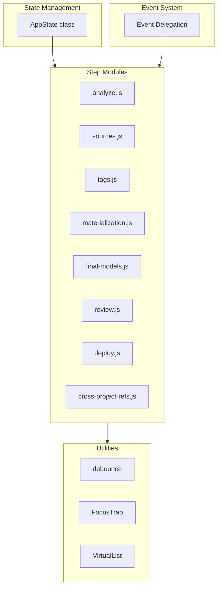
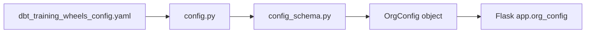
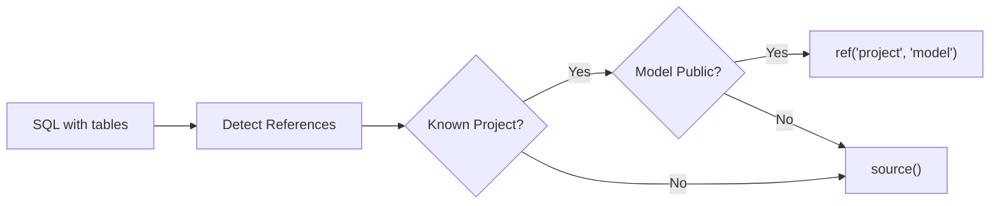
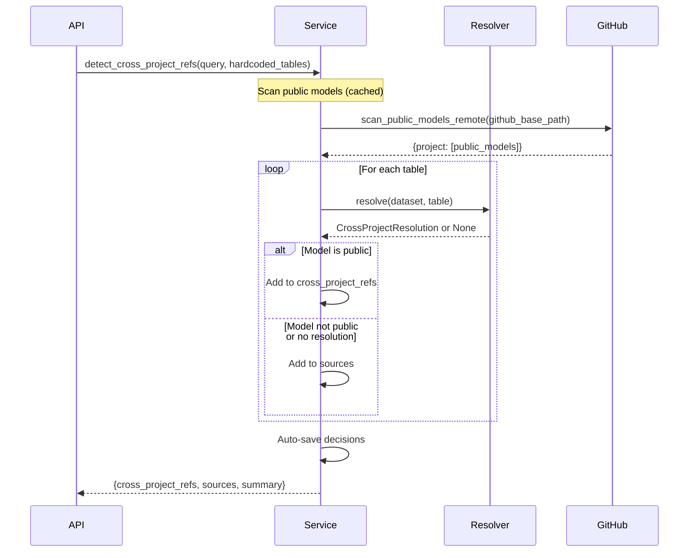

# DBT Training Wheels

SQL to dbt Migration Tool - Convert BigQuery scripts or any type of SQL scripts to dbt models.


## Prerequisites

- [Docker](https://docs.docker.com/get-docker/) installed on your machine

## Quick Start

**No `.env` files needed!** Just use your SSH keys.

### 1. Check SSH Keys (10 seconds)

```bash
ssh -T git@github.com
```

Should say: `Hi username! You've successfully authenticated...`

**Don't have SSH keys?** Generate one with `ssh-keygen -t ed25519`, then add the public key at <https://github.com/settings/keys>.

### 2. Build and Run with Docker (30 seconds)

```bash
docker-compose up --build
```

The `--build` flag builds the image automatically (first time takes ~1-2 minutes).

The application will start on http://localhost:8000

**Command variations:**
```bash
# With logs visible (recommended for first time)
docker-compose up --build

# Run in background (detached)
docker-compose up --build -d

# Rebuild from scratch (if needed)
docker-compose build --no-cache
docker-compose up
```

### 3. Use the Interface

Open http://localhost:8000 in your browser. Simply upload your SQL files and DBT Training Wheels will:
- Generate dbt models (staging, intermediate, marts)
- Create a pull request in your dbt repository
- **All commits are authored by YOU** (via your SSH keys!)

**Complete setup guide:** See [Reference](#reference) below and [CONTRIBUTING.md](./CONTRIBUTING.md)


### Best Practices

1. **Use descriptive project names**: `analytics` not `ap1`
2. **Include project identifiers in prefixes**: Configure `stg__<project>__`, `mart__<project>__` (not just `stg__`, `mart__`)
3. **Set reasonable default tags**: Include common schedules like `daily`, `weekly`
4. **Document scheduled_query_projects**: List all GCP projects with unmigrated queries
5. **Keep github.base_path organized**: Use `dbt_projects/{project_name}` pattern
6. **Set appropriate schedules**: Use cron syntax (`0 8 * * *` = 8 AM daily)
7. **Define all config per-project**: Don't rely on defaults - each project should be self-contained

## Stopping the App

Press `Ctrl + C` in terminal or run:
```bash
docker-compose down
```

## Troubleshooting

**"Permission denied (publickey)" error**
```bash
# Add your SSH key to GitHub
cat ~/.ssh/id_ed25519.pub  # or id_rsa.pub
# Copy and add at: https://github.com/settings/keys
```

**Container exits immediately**
```bash
# Check logs
docker-compose logs

# Usually means SSH keys aren't set up or config file is missing
```

**GitHub push fails**
- Verify SSH keys are working: `ssh -T git@github.com`
- Check you have write access to the target repository
- Confirm your key is registered at <https://github.com/settings/keys>

---

## Reference

- [Architecture](#architecture)
- [Layer Classification Rules](#layer-classification-rules)
- [Cross-Project References (dbt Mesh)](#cross-project-references-dbt-mesh)
- [Testing Guide](#testing-guide)
- [Deployment Guide](#deployment-guide)


---

## Architecture

### Overview

DBT Training Wheels is a Flask-based web application that converts SQL scripts to dbt models. It follows a modular architecture with clear separation of concerns.

### User Flow



### Request Lifecycle



### GitHub Push Flow



### Component Architecture



### Directory Structure

```
dbt_training_wheels/
├── app.py                 # Flask application entry point
├── config.py              # Configuration loading
├── config_schema.py       # Pydantic schemas & validation
├── container.py           # Service container (DI)
│
├── routes/
│   ├── web_routes.py      # HTML page routes
│   └── api/               # REST API (domain-split)
│       ├── __init__.py    # Blueprint registration
│       ├── analysis.py    # SQL analysis endpoints
│       ├── models.py      # Model configuration endpoints
│       ├── upload.py      # File upload endpoints
│       ├── github.py      # GitHub push endpoints
│       ├── config.py      # Config status endpoints
│       └── cross_project_refs.py  # Cross-project ref endpoints
│
├── services/              # Business logic layer
│   ├── github_service.py  # GitHub API integration
│   ├── query_service.py   # Query management
│   ├── file_generator.py  # dbt file generation
│   ├── template_service.py # Jinja template rendering
│   ├── sqlglot_parser.py  # SQL parsing with sqlglot
│   ├── cross_project_service.py  # Cross-project ref detection
│   └── resolvers/         # Cross-project resolvers
│       ├── base.py        # Abstract resolver interface
│       ├── dataset_resolver.py  # Dataset-based resolution
│       └── factory.py     # Resolver factory
│
├── parsers/               # Strategy pattern for SQL parsing
│   ├── base.py            # Abstract parser interface
│   ├── factory.py         # Parser factory
│   └── default.py         # Default SQL parser
│
├── repositories/          # Repository pattern for data access
│   ├── base.py            # Abstract repository interface
│   └── memory.py          # In-memory implementation
│
├── storage/               # Storage abstraction
│   └── base.py            # FileSystemStorage class
│
├── factories/             # Factory pattern
│   └── config_factory.py  # Configuration factory
│
├── utils/                 # Utilities
│   ├── __init__.py        # Exports
│   └── validators.py      # Input validation functions
│
├── exceptions/            # Custom exceptions
│   ├── __init__.py
│   └── dbt_training_wheels_exceptions.py  # Exception factory methods
│
├── static/
│   ├── css/               # Stylesheets
│   └── js/                # Frontend JavaScript
│       ├── main.js        # App initialization
│       ├── state.js       # Centralized state (AppState)
│       ├── events.js      # Event delegation system
│       ├── utils.js       # Utilities (debounce, FocusTrap, VirtualList)
│       ├── validation.js  # Form validation
│       └── steps/         # Step-specific modules
│
└── templates/             # Jinja2 templates
    ├── index.html         # Main SPA template
    ├── troubleshooting.html
    └── dbt/               # dbt file templates
        ├── model.sql.j2
        ├── schema.yml.j2
        └── sources.yml.j2
```

### Design Patterns

#### Service Container (`container.py`)
Dependency injection container for managing service instances.

#### Strategy Pattern (`parsers/`)



#### Repository Pattern (`repositories/`)



#### Factory Pattern (`factories/`)
Configuration object creation with validation via Pydantic schemas.

### Frontend Architecture



### API Endpoints

| Endpoint | Method | Description |
|----------|--------|-------------|
| `/api/upload` | POST | Upload SQL file |
| `/api/files` | GET | List uploaded files |
| `/api/analyze/<id>` | POST | Analyze SQL file |
| `/api/models/config/<id>` | GET/POST | Model configuration |
| `/api/generate/<id>` | GET | Generate dbt files |
| `/api/github/push/<id>` | POST | Push to GitHub |
| `/api/cross-project-refs/detect/<id>` | POST | Detect cross-project refs |
| `/api/cross-project-refs/decisions/<id>` | GET/POST | Save/load decisions |
| `/api/health` | GET | Health check |

### Configuration

Configuration is loaded from `dbt_training_wheels_config.yaml` using Pydantic schemas:



Key configuration sections:
- `naming` - Model naming conventions
- `database` - SQL dialect settings
- `github` - GitHub integration
- `cross_project_refs` - Cross-project reference detection (dbt Mesh)


---

## Layer Classification Rules

This document explains how dbt_training_wheels automatically classifies SQL queries into the 3-layer dbt architecture: **Staging (STG)**, **Intermediate (INT)**, and **Mart (MART)**.

### Overview

dbt_training_wheels analyzes SQL complexity and structure to determine which layer each model belongs to. This ensures consistent organization and follows dbt best practices.

### Architecture Layers

#### Staging Layer (STG)
**Purpose:** Simple data extraction and light shaping from external sources

**Characteristics:**
- Direct SELECT from external/source tables
- Minimal transformation logic
- Basic filters (WHERE clauses)
- Simple data type conversions
- Column renaming/aliasing

**Pattern:**
```sql
-- Simple source wrapper
SELECT
  id,
  name,
  created_date
FROM {{ source('external_system', 'raw_table') }}
WHERE active = true
```

#### Intermediate Layer (INT)
**Purpose:** Business logic transformations, calculations, and data enrichment

**Characteristics:**
- Complex transformations
- Multiple CTEs (WITH clauses)
- JOINs between tables
- Aggregations (GROUP BY, window functions)
- Business logic (CASE statements, calculations)
- Feature engineering

**Pattern:**
```sql
-- Complex transformation
WITH prep AS (
  SELECT ...
  FROM {{ source('...', '...') }}
),
calculations AS (
  SELECT
    *,
    calculation_field_1,
    calculation_field_2
  FROM prep
  WHERE complex_condition
)
SELECT * FROM calculations
```

#### Mart Layer (MART)
**Purpose:** Final business-facing models

**Characteristics:**
- Thin wrapper around INT or STG models
- Simple SELECT * pattern
- User-designated as final output
- Consumed by BI tools, dashboards, or end users

**Pattern:**
```sql
-- Mart wrapper
SELECT * FROM {{ ref('int__model_name') }}
```

### Classification Rules

#### Rule 1: Staging Classification

A model is classified as **Staging** if **ALL** of the following are true:

1. ✅ **All references are external** (no internal tables being created)
2. ✅ **No CTEs** (no WITH clauses)
3. ✅ **Low complexity** (SCS < 3)

**Example:**
```sql
-- STAGING: Simple source extract
SELECT
  customer_id,
  order_date,
  amount
FROM {{ source('ecommerce', 'orders') }}
WHERE order_date >= '2024-01-01'
```

**SCS Calculation:**
- Base: 1
- AND conditions: 1
- **Total SCS: 2** (< 3) ✅ → **STAGING**

#### Rule 2: Intermediate Classification

A model is classified as **Intermediate** if **ANY** of the following are true:

1. ✅ **Has CTEs** (contains WITH clauses)
2. ✅ **High complexity** (SCS >= 3)
3. ✅ **Has internal references** (references other models being created)

**Example 1: Has CTEs**
```sql
-- INTERMEDIATE: Has CTEs
WITH customer_base AS (
  SELECT * FROM {{ source('crm', 'customers') }}
),
orders AS (
  SELECT * FROM {{ source('ecommerce', 'orders') }}
)
SELECT
  c.*,
  COUNT(o.order_id) as order_count
FROM customer_base c
LEFT JOIN orders o ON c.id = o.customer_id
GROUP BY c.id
```

**Reason:** Contains 2 CTEs → **INTERMEDIATE**

**Example 2: High Complexity (SCS >= 3)**
```sql
-- INTERMEDIATE: High SCS
SELECT
  customer_id,
  SUM(amount) as total,
  COUNT(*) as count,
  AVG(amount) as avg_amount
FROM {{ source('ecommerce', 'orders') }}
WHERE status = 'completed'
  AND order_date >= '2024-01-01'
  AND amount > 0
GROUP BY customer_id
```

**SCS Calculation:**
- Base: 1
- JOINs: 0
- GROUP BY: 1
- AND conditions: 3
- **Total SCS: 5** (>= 3) ✅ → **INTERMEDIATE**

**Example 3: Internal References**
```sql
-- INTERMEDIATE: References another model being created
SELECT *
FROM {{ ref('other_table_in_this_migration') }}
WHERE active = true
```

**Reason:** References internal table → **INTERMEDIATE**

#### Rule 3: Mart Classification

Mart classification is **role-based**, not structural:

1. ✅ **User selects** which tables should be final outputs
2. System creates mart wrapper regardless of underlying complexity
3. Mart always references the structural layer (STG or INT)

**Flow:**
```
User selects "customer_metrics" as final output
→ System creates int__customer_metrics (transformation logic)
→ System creates mart__customer_metrics (SELECT * wrapper)
```

### SQL Complexity Score (SCS)

The SCS quantifies query complexity using this formula:

```
SCS = 1 (base) +
      JOINs +
      Subqueries +
      UNIONs +
      CASE statements +
      AND/OR conditions +
      GROUP BY (1 if present) +
      HAVING (1 if present) +
      Window functions × 2 +
      DISTINCT (1 if present)
```

#### SCS Thresholds

- **SCS < 3:** Low complexity → Potential **STAGING** candidate
- **SCS >= 3:** Higher complexity → **INTERMEDIATE** layer

#### SCS Examples

**Example 1: Simple Query (SCS = 2)**
```sql
SELECT DISTINCT customer_id
FROM source_table
WHERE active = true
```
- Base: 1
- AND: 1
- DISTINCT: 1
- **Total: 2** → Low complexity (but needs no CTEs too for STG)

**Example 2: Medium Query (SCS = 5)**
```sql
SELECT
  customer_id,
  COUNT(*) as orders
FROM source_table
WHERE status = 'active'
  AND date >= '2024-01-01'
GROUP BY customer_id
```
- Base: 1
- ANDs: 2
- GROUP BY: 1
- Aggregation context: included in GROUP BY
- **Total: 4** → Medium complexity → **INTERMEDIATE**

**Example 3: Complex Query (SCS = 12)**
```sql
SELECT
  a.customer_id,
  COUNT(*) as orders,
  SUM(CASE WHEN a.status = 'VIP' THEN 1 ELSE 0 END) as vip_orders,
  ROW_NUMBER() OVER (PARTITION BY a.region ORDER BY a.date) as rank
FROM table_a a
LEFT JOIN table_b b ON a.id = b.id
WHERE a.active = true
  AND a.date >= '2024-01-01'
GROUP BY a.customer_id
```
- Base: 1
- JOINs: 1
- CASE: 1
- ANDs: 2
- GROUP BY: 1
- Window function: 2 (× 2 weight)
- **Total: 8** → High complexity → **INTERMEDIATE**

### Classification Decision Tree

```
┌─────────────────────────────────────────┐
│ Analyze SQL Query                       │
└─────────────┬───────────────────────────┘
              │
              ▼
    ┌─────────────────────┐
    │ Has internal refs?  │───YES──→ INTERMEDIATE
    └─────────┬───────────┘
              │ NO
              ▼
    ┌─────────────────────┐
    │ Has CTEs?           │───YES──→ INTERMEDIATE
    └─────────┬───────────┘
              │ NO
              ▼
    ┌─────────────────────┐
    │ SCS >= 3?           │───YES──→ INTERMEDIATE
    └─────────┬───────────┘
              │ NO
              ▼
         ┌─────────┐
         │ STAGING │
         └─────────┘
              │
              ▼
    ┌─────────────────────┐
    │ User selected       │
    │ as final output?    │
    └─────────┬───────────┘
              │
              ├─YES─→ Create STG + MART wrapper
              │
              └─NO──→ Create STG only
```

### Model Naming Pattern

After classification, models are named with layer-specific prefixes:

**Staging Models:**
```
stg__<source>__<table_name>.sql
```

**Intermediate Models:**
```
int__<descriptive_name>.sql
```

**Mart Models:**
```
mart__<business_entity>.sql
```

### Common Scenarios

#### Scenario 1: Simple Source Extract → STG + MART

**SQL:**
```sql
SELECT * FROM external_table WHERE active = true
```

**Classification:**
- No CTEs ✅
- SCS = 2 (base + 1 WHERE) ✅
- External only ✅
- **Result:** STAGING

**Files Created:**
- `stg__external_table.sql` (transformation logic)
- `mart__external_table.sql` (if user selected)

#### Scenario 2: Complex Transformation → INT + MART

**SQL:**
```sql
WITH base AS (
  SELECT * FROM external_table
),
aggregated AS (
  SELECT
    customer_id,
    SUM(amount) as total
  FROM base
  GROUP BY customer_id
)
SELECT * FROM aggregated
```

**Classification:**
- Has 2 CTEs ✅
- **Result:** INTERMEDIATE

**Files Created:**
- `int__table_name.sql` (full transformation with CTEs)
- `mart__table_name.sql` (SELECT * FROM ref('int__table_name'))

#### Scenario 3: Multiple Tables → Mixed Classification

**SQL with 2 INSERT statements:**
```sql
-- Table 1: Simple
INSERT INTO table_1
SELECT id, name FROM external_source WHERE active = true;

-- Table 2: Complex
INSERT INTO table_2
WITH calculations AS (...)
SELECT * FROM calculations;
```

**Classification:**
- Table 1: No CTEs, SCS < 3 → **STAGING**
- Table 2: Has CTEs → **INTERMEDIATE**

**Files Created:**
- `stg__table_1.sql`
- `mart__table_1.sql` (if selected)
- `int__table_2.sql`
- `mart__table_2.sql` (if selected)

#### Scenario 4: No CTEs but High SCS → INT

**SQL:**
```sql
SELECT
  customer_id,
  SUM(CASE WHEN type = 'A' THEN amount ELSE 0 END) as type_a_total,
  SUM(CASE WHEN type = 'B' THEN amount ELSE 0 END) as type_b_total,
  COUNT(DISTINCT order_id) as distinct_orders
FROM external_table
WHERE date >= '2024-01-01'
  AND status = 'completed'
  AND amount > 0
GROUP BY customer_id
```

**SCS Calculation:**
- Base: 1
- CASE: 2
- ANDs: 3
- GROUP BY: 1
- DISTINCT: 1
- **Total: 8** (>= 3) ✅

**Classification:** **INTERMEDIATE** (high SCS, even without CTEs)

### Key Principles

1. **CTEs Always Mean Intermediate**
   - Any WITH clause automatically classifies as INT
   - CTEs stay inline within the model (not extracted separately)

2. **Complexity Matters**
   - Even without CTEs, high SCS (>= 3) means INT
   - Complexity accounts for JOINs, aggregations, CASE logic, etc.

3. **Staging is Rare**
   - Only truly simple source extracts qualify
   - Most real-world queries have SCS >= 3

4. **Mart is a Role, Not Structure**
   - User designates which models are final outputs
   - System creates thin wrappers automatically

5. **Same Base Name Pattern**
   - Mart models always reference their structural layer with same base name
   - `mart__customer_metrics` → `ref('int__customer_metrics')`
   - Never `ref('int__some_cte_name')`

### Testing Your Classification

To verify classification for your SQL files, use the testing framework:

```bash
# Discover actual classification
python tests/run_analysis_tests.py --test "YourTest" --discover

# Validate expected classification
python tests/run_analysis_tests.py --test "YourTest"
```

See [TESTING.md](#testing-guide) for detailed testing documentation.

### Related Documentation

- [ARCHITECTURE.md](#architecture) - Overall system architecture
- [TESTING.md](#testing-guide) - How to test layer classification
- [CROSS_PROJECT_REFS.md](#cross-project-references-dbt-mesh) - Handling cross-project references


---

## Cross-Project References (dbt Mesh)

Documentation for the cross-project reference detection feature.

### Overview

This feature detects when SQL references tables from other dbt projects and allows users to convert them to `{{ ref('project', 'model') }}` syntax instead of `{{ source() }}`.

**Key Feature:** Automatic verification that models are marked `access: public` before suggesting cross-project refs.

### How It Works



1. **Detection**: After SQL analysis, tables are checked against configured dataset-to-project mappings
2. **Public Model Verification**: Scans GitHub/local repos to verify models have `access: public`
3. **Auto-Save**: Detected refs are automatically saved as decisions for downstream use
4. **SQL Transformation**: Original SQL is transformed with cross-project refs applied
5. **Generation**: Model files use cross-project ref() syntax for verified public models

### Configuration

Add to `dbt_training_wheels_config.yaml`:

```yaml
# Required: GitHub configuration (uses SSH keys - no token needed!)
github:
  enabled: true
  repository: "your-org/your-dbt-repo"
  default_branch: "main"

cross_project_refs:
  enabled: true
  resolver: dataset  # Currently only 'dataset' is supported
  projects:
    - name: analytics_platform
      datasets:
        - raw_customer
        - raw_clean
      github_base_path: "dbt_projects/analytics_platform"  # Path in repo to this project
    - name: finance
      datasets:
        - finance_raw
      github_base_path: "dbt_projects/finance"
```

#### Configuration Fields

| Field | Type | Description |
|-------|------|-------------|
| `enabled` | boolean | Enable/disable cross-project detection |
| `resolver` | string | Resolution strategy (`dataset` for MVP) |
| `projects` | list | List of project configurations |
| `projects[].name` | string | dbt project name (used in ref()) |
| `projects[].datasets` | list | BigQuery datasets owned by this project |
| `projects[].github_base_path` | string | Path to the dbt project in the GitHub repo (for scanning public models). Falls back to local scanning if not provided or GitHub not configured. |

#### Remote Scanning Methods

The feature scans remote repositories for models with `access: public`. It tries these methods in order:

**1. Git Clone with SSH (Primary Method)**
- Requires: `github.repository` set in config + SSH keys mounted
- How it works: Temporarily clones repo to `/tmp`, scans models, auto-deletes
- No token needed! Uses your mounted SSH keys automatically
- Fast with `--depth 1` (only latest commit)

**2. Local File Scanning (Fallback)**
- Requires: Projects on same filesystem
- How it works: Scans local directories directly
- Only used if SSH clone fails

**Note:** All GitHub operations now use SSH keys - no tokens required!

### Architecture

#### Components

```
services/
├── cross_project_service.py   # Business logic
└── resolvers/
    ├── base.py                # Abstract interface
    ├── dataset_resolver.py    # Dataset-based resolution
    └── factory.py             # Resolver factory
```

#### Resolution Flow



#### DatasetResolver

The MVP uses dataset-based resolution:

1. Parse table reference (e.g., `project.raw_customer.dim_customer`)
2. Extract dataset name (`raw_customer`)
3. Look up dataset in configured project mappings
4. Return resolution with project name and model name
5. Verify model is marked `access: public` via GitHub/local scan

**Public Model Verification:**
- Models are scanned from GitHub (remote) or filesystem (local)
- Only models with `access: public` in their schema files are suggested as cross-project refs
- Results are cached to avoid repeated GitHub API calls
- Models not verified as public fall back to `source()` syntax

### API Endpoints

#### Detect Cross-Project References

```
POST /api/cross-project-refs/<query_id>
```

**Description:** Detects cross-project references by analyzing hardcoded table references, verifying models are public, and auto-saving decisions.

**Response:**
```json
{
  "query_id": 1,
  "cross_project_refs": [
    {
      "original_reference": "raw_customer.dim_customer",
      "project": "analytics_platform",
      "model": "dim_customer",
      "suggested_ref": "{{ ref('analytics_platform', 'dim_customer') }}",
      "use_cross_ref": true
    }
  ],
  "sources": [
    {
      "original_reference": "raw_data.payments",
      "suggested_source": "{{ source('raw_data', 'payments') }}",
      "use_cross_ref": false
    }
  ],
  "summary": {
    "total_tables": 2,
    "cross_project_refs": 1,
    "sources": 1
  }
}
```

**Note:** Decisions are automatically saved to storage after detection.

#### Save/Load Decisions

```
POST /api/cross-project-refs/<query_id>/config
Content-Type: application/json

{
  "decisions": [
    {
      "original_reference": "raw_customer.dim_customer",
      "use_cross_ref": true,
      "project": "analytics_platform",
      "model": "dim_customer"
    }
  ]
}
```

**Response:**
```json
{
  "success": true,
  "message": "Cross-project reference decisions saved",
  "decisions_count": 1
}
```

```
GET /api/cross-project-refs/<query_id>/config
```

**Response:**
```json
{
  "query_id": 1,
  "decisions": [
    {
      "original_reference": "raw_customer.dim_customer",
      "use_cross_ref": true,
      "project": "analytics_platform",
      "model": "dim_customer"
    }
  ]
}
```

#### Get Feature Status

```
GET /api/cross-project-refs/status
```

**Description:** Returns feature status and scanned public models.

**Response:**
```json
{
  "enabled": true,
  "projects": ["analytics_platform", "finance"],
  "datasets": ["raw_customer", "raw_clean", "finance_raw"],
  "public_models": {
    "analytics_platform": ["dim_customer", "dim_store", "fct_sales"],
    "finance": ["stg_finance_data"]
  }
}
```

### UI Step

The cross-project refs step appears after SQL analysis when `cross_project_refs.enabled: true`.

#### Features

- **Automatic Detection**: Scans hardcoded table references and checks against configured projects
- **Public Model Verification**: Only suggests cross-project refs for models verified as `access: public`
- **Auto-Save**: Decisions are automatically saved after detection (no manual save required)
- **Toggle Support**: Users can override and toggle between ref() and source() for each reference
- **Live Preview**: Shows suggested dbt syntax for each decision
- **Status Info**: Displays count of detected cross-project refs vs regular sources

#### User Experience

1. **Step triggers automatically** after SQL analysis if feature is enabled
2. **Detected refs are shown** with verification status (public model found or not)
3. **Decisions auto-saved** for use in subsequent steps (model generation, SQL transformation)
4. **Users can modify** any auto-detected decisions if needed
5. **Skip step** if no cross-project refs detected

#### Public Model Requirement

Cross-project refs only work with models marked `access: public` in their source project. The system automatically verifies this by scanning the remote/local dbt projects before suggesting a cross-project ref.

### Generated Output

#### SQL Transformation

When cross-project refs are detected and saved, the SQL is automatically transformed:

**Original SQL (hardcoded reference):**
```sql
SELECT
    customer_id,
    customer_name
FROM `project.raw_customer.dim_customer`
WHERE active = true
```

**Transformed SQL (cross-project ref applied):**
```sql
SELECT
    customer_id,
    customer_name
FROM {{ ref('analytics_platform', 'dim_customer') }}
WHERE active = true
```

**If not verified as public (falls back to source):**
```sql
SELECT
    customer_id,
    customer_name
FROM {{ source('raw_customer', 'dim_customer') }}
WHERE active = true
```

#### Diff View

The system preserves both original and transformed SQL:
- **Original SQL**: Kept for diff view in UI
- **Transformed SQL**: Used for final model generation
- Users can see exactly what changed in the "Updated SQL" step

#### File Generation

Cross-project refs are excluded from `sources.yml` generation since they're not sources. Only true source references are included in the sources file.

### Implementation Details

#### Public Model Scanning

The system scans for models with `access: public` in their schema files:

**GitHub Remote Scanning (Preferred):**
1. Uses `GitHubService.scan_public_models_remote(github_base_path)`
2. Fetches file tree from GitHub API at `{github_base_path}/models`
3. Reads each `.yml` file and parses for `access: public`
4. Returns set of verified public model names

**Local Scanning (Fallback):**
1. Uses `scan_public_models(github_base_path)` from `file_generator.py`
2. Walks local filesystem at the specified path
3. Parses YAML files for `access: public`
4. Returns set of verified public model names

**Caching:**
- Results are cached in `CrossProjectService._public_models_cache`
- Scan happens once per query analysis
- Avoids repeated GitHub API calls

#### Base Path Configuration

The `github_base_path` field solves the monorepo problem:

**Problem:** Multiple dbt projects in one repository
```
repo/
├── dbt_projects/
│   ├── analytics_platform/
│   │   └── models/
│   └── finance/
│       └── models/
```

**Solution:** Each project specifies its path
```yaml
projects:
  - name: analytics_platform
    github_base_path: "dbt_projects/analytics_platform"
  - name: finance
    github_base_path: "dbt_projects/finance"
```

**Critical:** Both preview endpoint and file generator must use the same `base_path` logic to avoid inconsistencies.

#### SQL Transformation Flow

1. **Load Decisions**: `load_decisions(query_id)` retrieves saved cross-project ref decisions
2. **Transform SQL**: `extract_and_transform_sql_for_table()` replaces hardcoded refs with dbt syntax
3. **Preserve Original**: Original SQL saved to `original_sql` field for diff view
4. **Update Analysis**: `hardcodedTables` updated with cross-project ref information

### Troubleshooting

#### No public models detected

**Symptoms:**
- All detected refs fall back to `source()` syntax
- Logs show "Found 0 public models"

**Causes:**
1. `github_base_path` not configured or incorrect
2. GitHub not configured (`github.enabled: false`)
3. Models don't have `access: public` in schema files
4. Path doesn't exist in repository

**Solutions:**
1. Verify `github_base_path` points to correct location in repo
2. Check SSH keys are working: `ssh -T git@github.com`
3. Verify `github.repository` is set correctly in config
4. Ensure target models have `access: public` in their schema YAML
5. Check logs for scanning errors (look for git clone messages)

#### sources.yml created when not needed

**Symptom:** `sources.yml` file created even when preview shows "No new sources needed"

**Cause:** Path mismatch between preview endpoint and file generator when scanning GitHub

**Solution:** Already fixed - both endpoints now use `get_project_config()` for consistent `base_path`.

### Future Enhancements

#### Manifest-Based Resolution

Parse `manifest.json` from other projects to:
- Verify exact model names exist in compiled manifest
- Validate dependencies and lineage
- Support more complex resolution logic

#### dbt Cloud API Integration

Integration with dbt Cloud to:
- Query model metadata via API
- Real-time access verification across environments
- Cross-account project references
- Automatic discovery of available projects

#### UI Enhancements

- Visual indicator of public model verification status
- Inline documentation about access levels
- Batch edit/toggle for multiple refs
- Preview of downstream impact


---

## Testing Guide

This document explains how to test the SQL analysis and layer classification logic in dbt_training_wheels.

### Overview

The testing framework allows you to verify that SQL files are correctly classified into layers (staging, intermediate, mart) based on their complexity and structure.

### Test Framework Components

#### 1. Test Definitions File (`test_definitions.yaml`)

A YAML file that defines test cases with expected outcomes.

**Structure:**
```yaml
test_cases:
  - name: "Test Case Name"
    sql_file: "../path/to/sql_file.sql"
    description: "What this test validates"
    user_mart_selection:
      - "table_name_1"  # Tables user selects as final outputs
      - "table_name_2"
    expected:
      staging: 2           # Expected staging models
      intermediate: 1      # Expected intermediate models
      mart: 2              # Expected mart models
      total_models: 5      # Expected total
```

**Field Descriptions:**
- `name`: Descriptive test name
- `sql_file`: Relative path to SQL file being tested
- `description`: Brief explanation of what's being validated
- `user_mart_selection`: List of table names the user selects as final mart outputs
- `expected`: Expected model counts for each layer

**Using `null` for Discovery:**
Use `null` for any expected value you want to skip checking:
```yaml
expected:
  staging: null       # Won't validate this
  intermediate: 2     # Will validate this
  mart: null          # Won't validate this
  total_models: null  # Won't validate this
```

#### 2. Test Runner Script (`run_analysis_tests.py`)

Python script that:
1. Loads test definitions
2. Runs SQL analysis for each test case
3. Compares actual results with expected values
4. Reports pass/fail status

### Running Tests

#### Discovery Mode

Use discovery mode when you don't know what the expected values should be:

```bash
# Run all tests in discovery mode
python tests/run_analysis_tests.py --discover

# Run specific test in discovery mode
python tests/run_analysis_tests.py --test "TestName" --discover
```

**Discovery mode:**
- Shows actual classification results
- Doesn't compare against expected values
- Useful for finding correct expected values

#### Validation Mode

Once you've set expected values, run tests normally:

```bash
# Run all tests
python tests/run_analysis_tests.py

# Run specific test (partial name match)
python tests/run_analysis_tests.py --test "TestName"
```

**Validation mode:**
- Compares actual vs expected
- Reports pass/fail for each metric
- Exit code 0 (success) or 1 (failure)

### Test Output

#### Example Success Output

```
================================================================================
Test: My Test Case
================================================================================
Description: Complex query with multiple CTEs
SQL File: /path/to/file.sql
Detected tables: ['table1', 'table2']
User mart selection: ['table1', 'table2']

Actual Results:
  Staging:      0
  Intermediate: 2
  Mart:         2
  Total:        4

  INTERMEDIATE models: table1, table2
  MART models: table1, table2

Expected Results:
  Staging: 0
  Intermediate: 2
  Mart: 2
  Total Models: 4

Comparison:
  staging: ✅ PASS (expected=0, actual=0)
  intermediate: ✅ PASS (expected=2, actual=2)
  mart: ✅ PASS (expected=2, actual=2)
  total_models: ✅ PASS (expected=4, actual=4)
```

#### Example Failure Output

```
Comparison:
  staging: ✅ PASS (expected=0, actual=0)
  intermediate: ❌ FAIL (expected=1, actual=2)
  mart: ✅ PASS (expected=2, actual=2)
  total_models: ❌ FAIL (expected=3, actual=4)
```

#### Summary Output

```
================================================================================
SUMMARY
================================================================================
Total tests: 5
Passed:      4 ✅
Failed:      1 ❌
Skipped:     0 ⚠️
```

### Layer Classification Rules

Tests validate that SQL files are classified according to these rules:

#### Staging Layer
Models classified as staging if:
- **All** references are external (no internal tables)
- **AND** no CTEs (no WITH clauses)
- **AND** low complexity (SCS < 3)

**Example:** Simple SELECT from external source with basic WHERE filter

#### Intermediate Layer
Models classified as intermediate if:
- **Any** internal references (other models being created), **OR**
- Has CTEs (WITH clauses), **OR**
- High complexity (SCS >= 3)

**Example:** Complex transformations with JOINs, aggregations, CTEs

#### Mart Layer
- Count determined by user selection
- Mart models are thin wrappers: `SELECT * FROM {{ ref('int_model') }}`
- Not a structural classification, but a role designation

#### SQL Complexity Score (SCS)

Formula:
```
SCS = 1 (base) + JOINs + Subqueries + UNIONs + CASEs + ANDs/ORs +
      GROUP BY + HAVING + (Windows × 2) + DISTINCT
```

**Thresholds:**
- SCS < 3: Low complexity (potential staging candidate)
- SCS >= 3: Higher complexity (intermediate layer)

### Writing Test Cases

#### Step 1: Add SQL File

Place your SQL file in the appropriate testing directory.

#### Step 2: Create Test Definition

Add a test case to `test_definitions.yaml`:

```yaml
- name: "Descriptive Test Name"
  sql_file: "../path/to/your_file.sql"
  description: "Explain what this test validates"
  user_mart_selection:
    - "table_name"  # Use actual table name from SQL, not filename
  expected:
    staging: null
    intermediate: null
    mart: null
    total_models: null
```

#### Step 3: Run Discovery

```bash
python tests/run_analysis_tests.py --test "YourTest" --discover
```

**Check the output:**
- Review the detected tables
- Note the actual counts
- Check which models are in each layer
- Verify the classification makes sense

#### Step 4: Verify Classification

Ask yourself:
- **Staging correct?** Simple source wrappers only?
- **Intermediate correct?** Has CTEs, JOINs, or transformations?
- **Mart correct?** Matches user selection count?

#### Step 5: Update Expected Values

If the classification is correct, update YAML:

```yaml
expected:
  staging: 0
  intermediate: 2
  mart: 1
  total_models: 3
```

#### Step 6: Run Test

```bash
python tests/run_analysis_tests.py --test "YourTest"
```

Should see all ✅ PASS results.

### Common Test Scenarios

#### Scenario 1: Simple Source Extract
**Characteristics:**
- No CTEs
- No JOINs
- Basic WHERE filter
- Low SCS

**Expected:**
```yaml
expected:
  staging: 1
  intermediate: 0
  mart: 1
  total_models: 2  # 1 STG + 1 MART
```

#### Scenario 2: Complex Transformation
**Characteristics:**
- Multiple CTEs
- JOINs
- Aggregations
- High SCS

**Expected:**
```yaml
expected:
  staging: 0
  intermediate: 1
  mart: 1
  total_models: 2  # 1 INT + 1 MART
```

#### Scenario 3: Multiple Tables
**Characteristics:**
- 2+ CREATE/INSERT statements
- Each with transformations
- User selects all as marts

**Expected:**
```yaml
user_mart_selection:
  - "table1"
  - "table2"
expected:
  staging: 0
  intermediate: 2
  mart: 2
  total_models: 4  # 2 INT + 2 MART
```

#### Scenario 4: Mixed Complexity
**Characteristics:**
- Some simple tables (staging)
- Some complex tables (intermediate)
- User selects some as marts

**Expected:**
```yaml
expected:
  staging: 2       # Simple wrappers
  intermediate: 1  # Complex transformation
  mart: 2          # User-selected finals
  total_models: 5  # 2 STG + 1 INT + 2 MART
```

### Troubleshooting

#### Test Fails Due to Wrong Table Name

**Problem:**
```
INFO: Detected tables: ['actual_table_name']
INFO: User mart selection: ['wrong_table_name']
INFO: [Mart Selection] Split: 0 mart, 1 non-mart
```

**Solution:**
The table name in `user_mart_selection` must match the actual table name in the SQL (from CREATE/INSERT statement), not the filename.

Fix in YAML:
```yaml
user_mart_selection:
  - "actual_table_name"  # Use name from SQL
```

#### Test Fails Due to Wrong Classification

**Problem:**
```
intermediate: ❌ FAIL (expected=1, actual=2)
```

**Solution:**
1. Run in discovery mode to see details
2. Check the actual models created
3. Verify SCS calculation
4. Check for CTEs presence
5. Update expected values if classification is correct

#### No Tables Detected

**Problem:**
```
Detected tables: []
```

**Solution:**
- Verify SQL file has CREATE or INSERT statements
- Check file path is correct
- Ensure table names use standard format (not temp tables or variables)

### Best Practices

1. **Start with Discovery Mode**
   - Always use `--discover` first
   - Verify classification makes sense
   - Then set expected values

2. **Test Edge Cases**
   - Simple queries (STG validation)
   - Complex queries (INT validation)
   - Multiple tables
   - Mixed complexity

3. **Use Descriptive Names**
   - Test names should explain what's being validated
   - Descriptions should provide context

4. **Keep Tests Updated**
   - Re-run tests after changing classification logic
   - Update expected values if behavior changes intentionally

5. **Run Before Commits**
   - Validate changes don't break classification
   - Catch regressions early

6. **Document Special Cases**
   - Add comments in YAML for unusual cases
   - Explain why certain expected values are used

### Integration with CI/CD

To run tests in CI/CD pipelines:

```bash
# Exit code 0 on success, 1 on failure
python tests/run_analysis_tests.py
```

Example GitHub Actions:
```yaml
- name: Run analysis tests
  run: python tests/run_analysis_tests.py
```

Example pre-commit hook:
```bash
#!/bin/bash
python tests/run_analysis_tests.py
exit $?
```

### Related Documentation

- [ARCHITECTURE.md](#architecture) - Layer architecture and design principles
- [CROSS_PROJECT_REFS.md](#cross-project-references-dbt-mesh) - Cross-project reference handling
- [DEPLOYMENT.md](#deployment-guide) - Deployment process


---

## Deployment Guide

### Docker (Recommended)

#### Quick Start with SSH Keys (No tokens needed!)

```bash
docker-compose up --build
```

That's it! SSH keys are automatically mounted from `~/.ssh`.

See [README.md](README.md) for complete setup guide.

---

### Advanced Docker Usage

#### Build the Image

```bash
docker build -t dbt_training_wheels .
```

#### Run with Docker (SSH Keys)

```bash
docker run -p 8000:8000 \
  -v $(pwd)/dbt_training_wheels_config.yaml:/app/dbt_training_wheels_config.yaml:ro \
  -v ~/.ssh:/home/dbt_training_wheels/.ssh:ro \
  -e GIT_SSH_COMMAND="ssh -o StrictHostKeyChecking=accept-new" \
  dbt_training_wheels
```

#### Run with Docker Compose

```bash
docker-compose up --build
```

Docker Compose automatically:
- Mounts your SSH keys (read-only)
- Configures git SSH settings
- Maps port 8000

View logs:
```bash
docker-compose logs -f
```

### Environment Variables

| Variable | Required | Default | Description |
|----------|----------|---------|-------------|
| `SECRET_KEY` | No | (random) | Flask session secret key |
| `DBT_TRAINING_WHEELS_CONFIG_PATH` | No | `/app/dbt_training_wheels_config.yaml` | Path to config file |
| `MAX_CONTENT_LENGTH` | No | `2097152` (2MB) | Max request body size |
| `DEBUG` | No | `false` | Enable debug mode |
| `GIT_SSH_COMMAND` | No | (auto-set) | SSH command for git operations |

**Note:** All GitHub operations use SSH keys - no tokens required! Just mount `~/.ssh` into the container.

### Configuration File

Mount your `dbt_training_wheels_config.yaml` to `/app/dbt_training_wheels_config.yaml`:

```yaml
# docker-compose.yml
volumes:
  - ./dbt_training_wheels_config.yaml:/app/dbt_training_wheels_config.yaml:ro
```

See `dbt_training_wheels_config.example.yaml` for all available options.

### Health Check

The application exposes a health check endpoint:

- **Endpoint:** `GET /api/health`
- **Success response:** `{"status": "healthy"}`

Docker uses this endpoint for container health monitoring.

### Production Settings

The Docker image is configured for production:

- **Web server:** gunicorn (2 workers, 4 threads)
- **User:** Non-root (`dbt_training_wheels`)
- **Port:** 8000

#### Scaling

Adjust gunicorn workers in `Dockerfile`:

```dockerfile
CMD ["python", "-m", "gunicorn", "--bind", "0.0.0.0:8000", "--workers", "4", "--threads", "4", "dbt_training_wheels.app:app"]
```

### Local Development

For local development without Docker:

```bash
uv sync
uv run dbt-training-wheels --debug
```

Open http://localhost:8000 in your browser.
